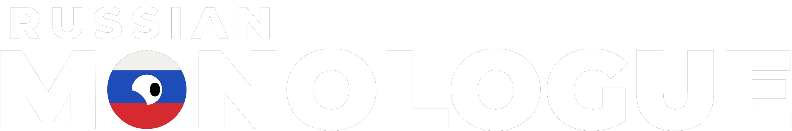

# russian-monologue

Форк [Monologue](https://github.com/monologue-tool/monologue) — редактора ветвящихся диалогов на Godot — с русским интерфейсом и удобствами для больших сценариев.
*A fork of [Monologue](https://github.com/monologue-tool/monologue), the Godot branching-dialogue editor, with a Russian interface and quality-of-life features for large scripts.*

**Что уже есть / What's in so far**
- Русский и английский интерфейс, «Правка → Настройки → Язык интерфейса», на лету. / Russian & English UI, switch live in Edit → Preferences.
- Условия фразой: несколько проверок через И / ИЛИ, «НЕ», «был в узле» (сколько раз проходили — без ручных флагов), «в карманах». / Conditions as several checks: AND/OR, NOT, "was at" a node, "carries" an item.
- Окно проигрывания: панель «Состояние» (переменные можно менять, карманы, пройдено) и перемотка после правки — как в Inky. / Run window: editable State panel; replays your path after an edit.
- Сохранённые маршруты: записать прохождение и потом проверить, что оно ещё проходит. / Saved routes: record a path, check it still gets through.
- «Правка → Проблемы и ссылки»: все проблемы одним списком (плюс переменные, которые меняют, но не проверяют, и пометки TODO), «где используется», «путь к концовке» — от концовки назад, что нужно на каждом пути. / Problems & usages window, where-used, path to an ending read backwards.
- Карточки схемы читаются без открытия (реплика целиком), узел «Заметка» — цветной стикер. / Readable cards, sticky Note node.
- Шаблоны: выделить узлы → «Сохранить как шаблон…», вставить через «Добавить → Шаблоны». / Templates with their wires.
- «Файл → Экспорт сценария (текст)…» — весь проект как сценарий для чтения. / Export the whole project as a readable script.
- Картинки рядом с именами: лица персонажей и иконки вещей на карточках, в списках и меню; «Вид → Показывать картинки». / Faces and item icons beside names; View → Show Pictures.
- Дополнения проекта: папка `monologue-plugins/<имя>/plugin.gd` рядом с файлом `.mnlp` добавляет свои узлы только этому проекту (при первом открытии Monologue спросит, доверять ли). Так узлы игры живут в игре, а не в этом репозитории. / Project add-ons: `monologue-plugins/<name>/plugin.gd` beside the `.mnlp` adds node types for that project only, after asking once. See `common/plugins/project_plugins.gd`.
- Группы сюжетных линий слева («Группа · Название»), открытие `.mnlp` при запуске. / Grouped storylines, open a file on startup.

Перевод: таблица `i18n/make_ru.py` → `i18n/ru.csv` (английский текст — ключ). Translations live in `i18n/`.
Оригинальный проект и лицензия MIT — © Atomic Junky. Original project and MIT license © Atomic Junky.

---

   

Monologue is a **dynamic, flexible, open-source dialogue editor** for creating branching, non-linear conversations in games. It provides a **graph-based interface** that makes it easy to visually craft modular dialogue flows. The editor is “engine agnostic”: a project is an archive of plain JSON documents, so you can prototype your story here and read it from any game engine or framework (as long as an interpreter is written for that engine or you write it).

## Features

* **User-friendly UI:** Intuitive, modern node-graph interface for writing dialogue.
* **Flexible storytelling:** Design dynamic, branching storylines and non-linear narratives.
* **Integrated content:** Manage dialogue text along with characters, backgrounds, audio, etc. all in one place.
* **Node-based workflow:** Each step of your conversation is a *node* with custom properties and tasks.
* **Manage voicelines, music and languages:** Integrate voicelines, translations and music directly into the editor.
* **In-editor testing:** Play and debug your dialogue right inside Monologue (start from any node).
* **Open & Cross-platform:** Fully MIT-licensed open source. Standalone builds are available for Windows and Linux.

## Getting Started

1. **Download:** Get the latest version from the [GitHub Releases](https://github.com/monologue-tool/monologue/releases) page or [itch.io](https://atomic-junky.itch.io/monologue). (Windows and Linux executables are provided.)
2. **Run Monologue:** Launch the downloaded executable (no installation needed). Alternatively, clone the repo and open it in Godot Engine 4.7 or newer — see [CONTRIBUTING.md](CONTRIBUTING.md).
3. **Create/Open a Story:** In Monologue’s UI, create a new project (`*.mnlp`) or open an existing one. A blank node canvas appears.
4. **Add Dialogue Nodes:** Click **Add a Node...** to create conversation nodes. Click a node to edit its properties.
5. **Connect Nodes:** Drag connectors between nodes to build your conversation branches and choices.
6. **Play and Test:** Use the **▶️** button to play through the story from any selected node or from the start. This lets you immediately test how the dialogue flows.
7. **Save/Export:** Save your project. A `.mnlp` file is a zip archive of JSON documents — a manifest, your storylines, and shared collections such as characters and variables — which you can read from your game or engine.

## Use Cases

Monologue can be used anywhere you need structured dialogues or narrative flowcharts. Common examples include:

* **Visual Novels:** Craft branching storylines and character conversations for a visual novel.
* **RPG/Adventure Dialogues:** Design NPC dialog trees, quest conversations, and interactive story events.
* **Interactive Fiction:** Prototype text adventures, or story-driven dialogue sequences.
* **Rapid Prototyping:** Quickly sketch out narrative flows or script conversations before implementing them in-game.

## Contributing

Contributions are welcome! To help improve Monologue, you can:

* **Report Issues:** Open issues on GitHub to report bugs or suggest new features.
* **Submit Pull Requests:** Fork the repo, make your changes (code, UI improvements, tests, etc.), and submit a PR.
* **Improve Documentation:** Help write or translate docs, examples, and usage guides.
* **Share Media:** Contribute UI screenshots, example projects, tutorials, or art assets.
* **Join Discussion:** Participate in GitHub Discussions or chat to give feedback and ideas.

Read [CONTRIBUTING.md](CONTRIBUTING.md) first: it covers the Godot version you need, how to run the tests, the formatting rules, and where to start. Every contribution (code, docs, examples, etc.) helps make Monologue better!

## Credits

Made by [Atomic Junky](https://github.com/atomic-junky/).  
With the contribution of [RailKill](https://github.com/RailKill) and [Jeremi Biernacki](https://github.com/Jeremi360).

Monologue was originally a fork of [Amberlim's GodotDialogSystem](https://github.com/Amberlim/GodotDialogSystem).

## License

This project is licensed under the terms of the [MIT license](https://github.com/atomic-junky/Monologue/blob/main/LICENSE).
