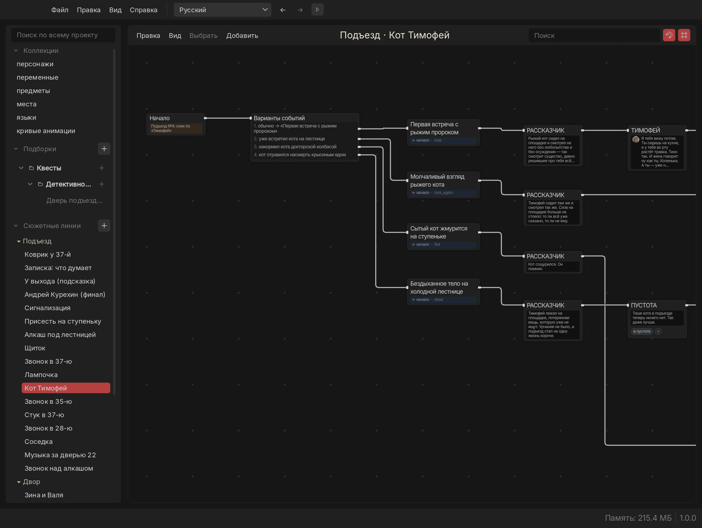
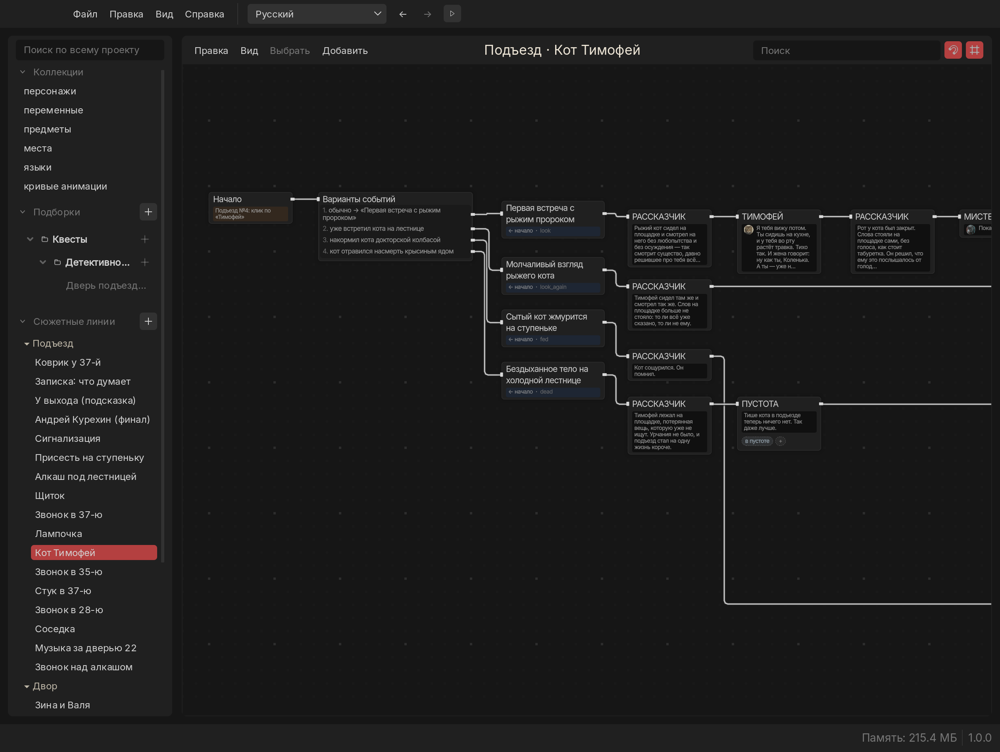
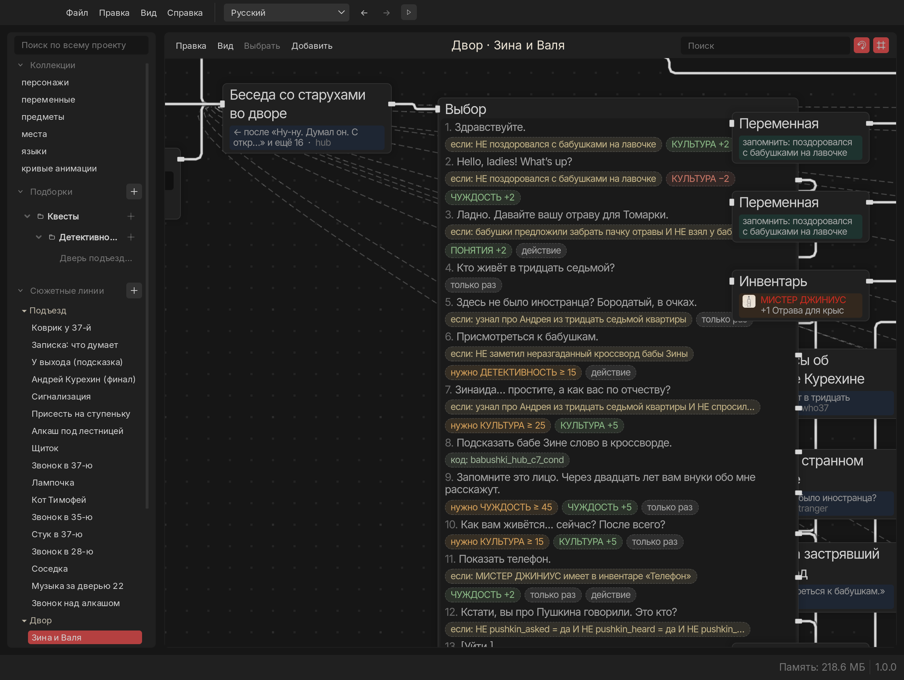
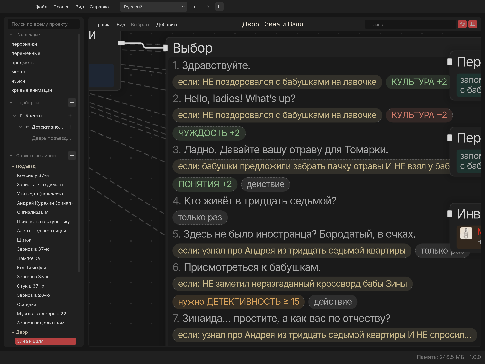
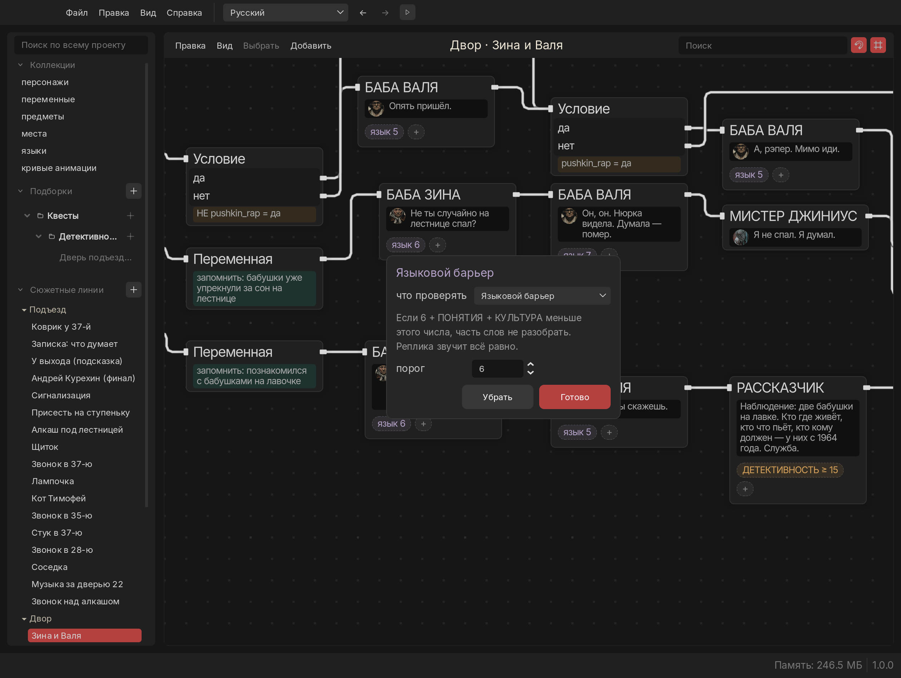
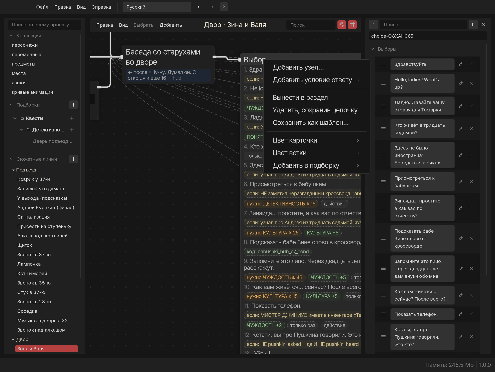

# Russian Monologue

**Редактор ветвящихся диалогов для игр, переделанный под живую работу сценариста.**
**A branching-dialogue editor for games, reworked for the way writers actually work.**

[Русский](#русский) · [English](#english) · [Памятка автору / Writer's guide](АВТОРАМ.md)

<!-- скриншоты сняты из самой программы: docs/screenshots/*.png -->

| «Разложить просторно» | «Разложить плотно» |
|---|---|
|  |  |

| Условия ответов — метками | Метки вблизи |
|---|---|
|  |  |

| Клик по метке — правка | Правый клик |
|---|---|
|  |  |

---

## Русский

Russian Monologue — большой авторский форк [Monologue](https://github.com/monologue-tool/monologue), открытого редактора диалогов на Godot. Его ведёт [andreysuperfly](https://github.com/andreysuperfly) и проверяет в бою: на нём пишутся все диалоги игры «Гений в Санкт-Петербурге».

Это не перевод интерфейса поверх чужой программы. В форке **85 коммитов и около 7 000 новых строк кода**, переписана или заново написана **почти треть файлов редактора**. Схема, карточки, поиск, проверка истории, окно проигрывания — всё пересобрано вокруг одного вопроса: как сценаристу не потеряться в сотнях реплик.

### Чем он лучше оригинала

**Схема читается без кликов**
- Карточки показывают реплику целиком, ответы пронумерованы 1. 2. 3. — как их увидит игрок.
- Провода не сливаются: параллельные линии разведены по дорожкам, обходят карточки, обратные связи — тонкие пунктирные дуги со стрелкой ↩.
- Две кнопки раскладки — «Разложить плотно» и «Разложить просторно» — выстраивают карточки по ходу истории без единого наложения, с полной отменой ⌘Z.
- Реплику можно править прямо на карточке двойным щелчком. Цвет карточки или целой ветки — правой кнопкой.
- Что решает, прозвучит ли реплика или будет ли доступен ответ, видно меткой прямо на карточке: «ДЕТЕКТИВНОСТЬ ≥ 15», «в пустоте», «нужно КУЛЬТУРА ≥ 25», «КУЛЬТУРА +5», «только раз». Клик по метке — маленькое окно правки (там же её можно превратить в другое условие), «+» или правый клик — новое условие.
- Правый клик по карточке — «Добавить узел…»: новый узел встаёт справа и сам подключается к свободному выходу.

**Условия словами, а не кодом**
- Несколько проверок через И / ИЛИ / НЕ, «был в узле» (сколько раз проходили — без ручных флагов), «в карманах».
- У переменной есть поле «по-человечески», и карточки читаются фразой: «если дверь выбита», «запомнить: дверь осмотрена».

**Ничего не теряется**
- Поиск по всему проекту: по любым словам, без учёта регистра и ё/е — реплики, ответы, говорящие, заметки, условия.
- «Проверка истории»: все проблемы одним списком, переменные, которые меняют, но не проверяют, пометки «ДОДЕЛАТЬ».
- «Где используется» — словами: какой ответ, что он требует или даёт. «Путь к концовке» — от концовки назад, что нужно на каждом пути.
- Свои папки-подборки для сюжетных линий и узлов, переходы «назад / вперёд» по местам в истории, открытие там, где остановились.

**Проверка на ходу**
- Окно проигрывания с панелью «Состояние»: переменные можно менять, видно карманы и пройденное, после правки путь проигрывается заново — как в Inky.
- Сохранённые маршруты: записать прохождение и потом убедиться, что оно всё ещё проходит.
- «Файл → Экспорт сценария (текст)…» — весь проект как читаемый текст.

**Под конкретную игру — без форка форка**
- Дополнения проекта: папка `monologue-plugins/<имя>/plugin.gd` рядом с `.mnlp` добавляет свои узлы и поля только этому проекту. Узлы игры живут в игре, а не в редакторе.
- Шаблоны: выделить узлы → «Сохранить как шаблон…», вставить вместе с проводами.

**Два языка по-честному**
- Русский и английский интерфейс переключаются на лету прямо в шапке; около 790 строк перевода, склонения по числам («1 ошибка / 3 ошибки / 5 ошибок»).
- Тесты следят, чтобы в коде интерфейса не осталось непереведённого текста.

### Установка

- **macOS:** установщик `.pkg` — на странице [Releases](https://github.com/andreysuperfly/russian-monologue/releases).
- **Из исходников:** открыть папку в Godot 4.7 — см. [CONTRIBUTING.md](CONTRIBUTING.md).

Как писать диалоги — короткая [памятка автору](АВТОРАМ.md).

---

## English

Russian Monologue is a major fork of [Monologue](https://github.com/monologue-tool/monologue), the open-source Godot dialogue editor. It is maintained by [andreysuperfly](https://github.com/andreysuperfly) and battle-tested daily: every dialogue of the game *Genius in Saint Petersburg* is written in it.

This is not a translation layered on someone else's app. The fork adds **85 commits and about 7,000 new lines of code**, and **nearly a third of the editor's files** are rewritten or new. The graph, the cards, search, story checking and the play window were all rebuilt around one question: how does a writer stay oriented among hundreds of lines?

### What it does better

**A graph you can read without clicking**
- Cards show the whole line; answers are numbered 1. 2. 3., the way the player sees them.
- Wires never merge: parallel lines get their own lanes and route around cards; back links are thin dashed arcs with a ↩.
- Two layout buttons, *Lay Out Tight* and *Lay Out Roomy*, arrange cards in story order with zero overlaps and full ⌘Z undo.
- Edit a line right on its card with a double click; colour a card or a whole branch from the right-click menu.

**Conditions in words, not code**
- Several checks with AND / OR / NOT, *was at* a node (visit counts, no manual flags), *carries* an item.
- Variables get an *In plain words* field, so cards read as sentences: "if the door is broken", "remember: door inspected".

**Nothing gets lost**
- Project-wide search: any words, case-insensitive — lines, answers, speakers, notes, conditions.
- *Problems and usages*: every problem in one list, variables that are set but never checked, TODO marks.
- *Where used* in plain words: which answer, what it needs or gives. *Path to an ending* reads backwards: what each route requires.
- Your own folders for storylines and nodes, back / forward through places in the story, reopens where you left off.

**Test as you write**
- A play window with a *State* panel: edit variables, see inventory and visited nodes; after an edit it replays your path, Inky-style.
- Saved routes: record a playthrough, then check it still gets through.
- *File → Export screenplay (text)…*: the whole project as a readable script.

**Fits a specific game without forking the fork**
- Project add-ons: `monologue-plugins/<name>/plugin.gd` beside the `.mnlp` adds node types and fields for that project only, after asking once.
- Templates: select nodes → *Save as template…*, insert them later with their wires.

**Two languages, done properly**
- Russian and English UI, switched live from the header; ~790 translated strings with proper plural forms.
- Tests make sure no untranslated text is left in interface code.

### Install

- **macOS:** a `.pkg` installer on the [Releases](https://github.com/andreysuperfly/russian-monologue/releases) page.
- **From source:** open the folder in Godot 4.7 — see [CONTRIBUTING.md](CONTRIBUTING.md).

---

Оригинальный Monologue и лицензия MIT — © Atomic Junky и соавторы. Ниже — описание оригинального проекта.
Original Monologue and its MIT license © Atomic Junky and contributors. The original project's description follows.

   

Monologue is a **dynamic, flexible, open-source dialogue editor** for creating branching, non-linear conversations in games. It provides a **graph-based interface** that makes it easy to visually craft modular dialogue flows. The editor is “engine agnostic”: a project is an archive of plain JSON documents, so you can prototype your story here and read it from any game engine or framework (as long as an interpreter is written for that engine or you write it).

## Features

* **User-friendly UI:** Intuitive, modern node-graph interface for writing dialogue.
* **Flexible storytelling:** Design dynamic, branching storylines and non-linear narratives.
* **Integrated content:** Manage dialogue text along with characters, backgrounds, audio, etc. all in one place.
* **Node-based workflow:** Each step of your conversation is a *node* with custom properties and tasks.
* **Manage voicelines, music and languages:** Integrate voicelines, translations and music directly into the editor.
* **In-editor testing:** Play and debug your dialogue right inside Monologue (start from any node).
* **Open & Cross-platform:** Fully MIT-licensed open source. Standalone builds are available for Windows and Linux.

## Getting Started

1. **Download:** Get the latest version from the [GitHub Releases](https://github.com/monologue-tool/monologue/releases) page or [itch.io](https://atomic-junky.itch.io/monologue). (Windows and Linux executables are provided.)
2. **Run Monologue:** Launch the downloaded executable (no installation needed). Alternatively, clone the repo and open it in Godot Engine 4.7 or newer — see [CONTRIBUTING.md](CONTRIBUTING.md).
3. **Create/Open a Story:** In Monologue’s UI, create a new project (`*.mnlp`) or open an existing one. A blank node canvas appears.
4. **Add Dialogue Nodes:** Click **Add a Node...** to create conversation nodes. Click a node to edit its properties.
5. **Connect Nodes:** Drag connectors between nodes to build your conversation branches and choices.
6. **Play and Test:** Use the **▶️** button to play through the story from any selected node or from the start. This lets you immediately test how the dialogue flows.
7. **Save/Export:** Save your project. A `.mnlp` file is a zip archive of JSON documents — a manifest, your storylines, and shared collections such as characters and variables — which you can read from your game or engine.

## Use Cases

Monologue can be used anywhere you need structured dialogues or narrative flowcharts. Common examples include:

* **Visual Novels:** Craft branching storylines and character conversations for a visual novel.
* **RPG/Adventure Dialogues:** Design NPC dialog trees, quest conversations, and interactive story events.
* **Interactive Fiction:** Prototype text adventures, or story-driven dialogue sequences.
* **Rapid Prototyping:** Quickly sketch out narrative flows or script conversations before implementing them in-game.

## Contributing

Contributions are welcome! To help improve Monologue, you can:

* **Report Issues:** Open issues on GitHub to report bugs or suggest new features.
* **Submit Pull Requests:** Fork the repo, make your changes (code, UI improvements, tests, etc.), and submit a PR.
* **Improve Documentation:** Help write or translate docs, examples, and usage guides.
* **Share Media:** Contribute UI screenshots, example projects, tutorials, or art assets.
* **Join Discussion:** Participate in GitHub Discussions or chat to give feedback and ideas.

Read [CONTRIBUTING.md](CONTRIBUTING.md) first: it covers the Godot version you need, how to run the tests, the formatting rules, and where to start. Every contribution (code, docs, examples, etc.) helps make Monologue better!

## Credits

Made by [Atomic Junky](https://github.com/atomic-junky/).  
With the contribution of [RailKill](https://github.com/RailKill) and [Jeremi Biernacki](https://github.com/Jeremi360).

Monologue was originally a fork of [Amberlim's GodotDialogSystem](https://github.com/Amberlim/GodotDialogSystem).

## License

This project is licensed under the terms of the [MIT license](https://github.com/atomic-junky/Monologue/blob/main/LICENSE).
